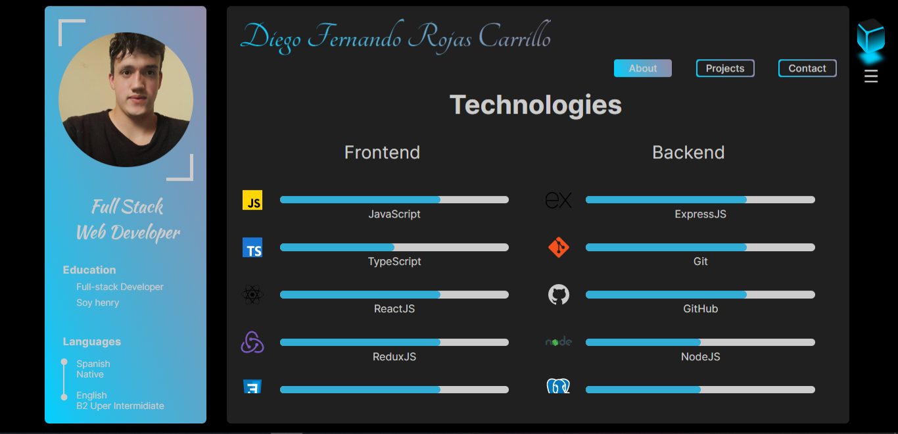

 

 <h2> About Me </h2>
 <ul>
   <li> I'm from Colombia, I started the Henry Bootcamp a few months ago. I am passionate about technology and look forward to continuing to learn and improve my technology skills </li>
   <li> I have knowledge of different technologies including React, Redux, Node JS, HTML among others </li>
   <li> I'm looking to learn new technologies like Payton and Angular </li>
   <li> If you want to contact me, you can find my email and Linkedin down below </li>
 </ul>

&nbsp;

## :paperclip: How to reach me:

  <a href="https://www.linkedin.com/in/diego-fernando-rojas-carrillo-full-stack-developer/" >
    
    <!--  -->
  </a>
  <a href="mailto:diego27Fernando72@gmail.com" >
    
    <!--  -->
  </a>
  
  

 
 
<h2>Portfolio</h2>

<a href="https://github.com/DF27ARTS/Fernando_Rojas/blob/main/images/My_CV.pdf" download >Download CV</a>
 
&nbsp;&nbsp;

## :star: Languages and Tools:

 

## Front-end Tools

  <code></code>
  <code></code>
  <code></code>
  <code></code>
  <code></code>
  <code></code>
  <code></code>

 
 

## Back-end Tools

  <code></code>
  <code></code>
  <code></code>
  <code></code>
  <code></code>
  <code></code>

 
 

## I'm learning

  <code></code>
  <code></code>
  <code></code>

 

<a href="https://icons8.com/">Link</a> to de svg icons page

&nbsp;

&nbsp;

## :pushpin: My proyects

  <a href="https://job-hunter-arkcl5zem-df27arts.vercel.app">
    <h3> Job Hunter </h3>
  </a>
  
 Job Hunter will help you keep track of all the job applications you make during your job search. It includes a landing page, login and registration features, filters, a search engine, and infinite loading. 

  
  <a></25
  
  

  <a href="https://henry-pi-dogs-d26rn64ql-df27arts.vercel.app/">
    <h3> Dogs Api </h3>
  </a>
  
 This is an application where you can find different dog breeds and you can also filter them by Weight and breed. 
  The application has a search to find by name and you have a form to create your own breed dog too 

  
  <a></25
  
  

  <a href="https://proyecto-final-rho-three.vercel.app/">
    <h3> Synnet </h3>
  <a>
  
In this application you can create and participate in different tournaments it also contains a gallery, chatbot, dashboard,
  filter, search engine, administration panel, payment method, sign up and login and more

  
  
  
  

   

  <a href="https://weather-app-dusky-phi.vercel.app/">
    <h3> Weather App </h3>
  </a>
  
This is an application where you can find the weather in different cities, it contains a search engine, the homepage, the favorites section, and the city details

  
  
  
  

&nbsp;
