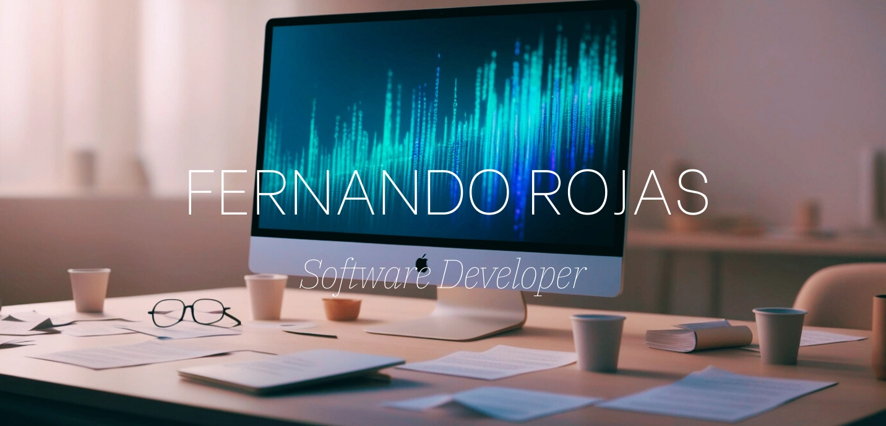
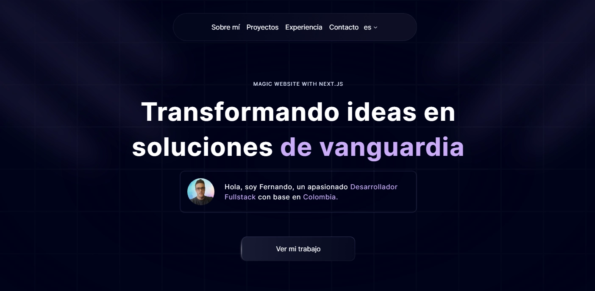

## About Me 

Desarrollador de Software con más de un año de
experiencia en la creación de interfaces de
usuario amigables utilizando frameworks como
React o Next.js. Mi enfoque está en desarrollar
aplicaciones web robustas y escalables,
asegurando una experiencia de usuario óptima y
cumpliendo con los estándares de la industria.

## Portfolio

[Open CV](https://fernandorojas.vercel.app/es/curriculum.pdf)

<!-- ## Front-end Tools

  <code></code>
  <code></code>
  <code></code>
  <code></code>
  <code></code>
  <code></code>
  <code></code>

 
 

## Back-end Tools

  <code></code>
  <code></code>
  <code></code>
  <code></code>
  <code></code>
  <code></code>

 
 

## I'm learning

  <code></code>
  <code></code>
  <code></code>

  -->

